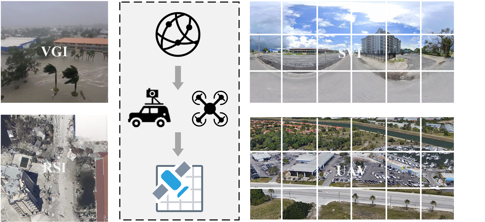
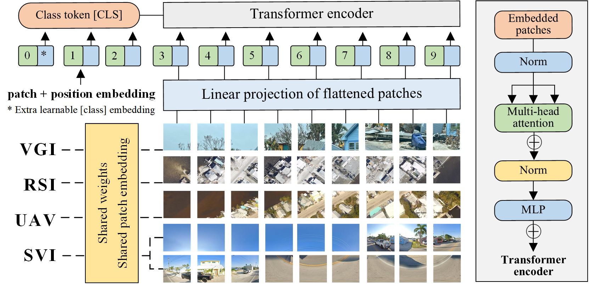

# SAGINGeo: A space-aerial-ground integrated framework for multi-disaster cross-view geolocalization


<p align="center">
     
</p>

In this paper, we propose SAGINGeo, a novel cross-view geolocalization framework that enhances VGI geolocalization by using panoramic SVI and UAV imagery as intermediate bridges to RSI. Powered by ViT models, SAGINGeo integrates spatial information from space, aerial, and ground views through unified multi-view joint training. An anchor-guided reranking strategy is also introduced to refine retrieval results based on semantic similarity. To evaluate our framework, we constructed SAGINDisaster, a dedicated cross-view dataset covering four disaster types and integrating VGI, SVI, UAV, and RSI sources.

<br/>


## SAGINDisaster dataset

SAGINDisaster is a cross-view dataset of four disaster types, combining VGI, SVI, UAV, and RSI, with 2,080 groups, 118,560 images, and 2,080 simulated UAV videos. The dataset is available at the following link.


### Preview of dataset images
<p align="center">
     
</p>


### Data splitting

Before training, the train-test split of the SAGINDisaster dataset needs to be prepared.

The training and test sets can be customized by the user. We can generate the splits and pre-process the images with flexible train-test ratios ranging from 1:9 to 9:1, or directly use the predefined 8:2 and 7:3 splits provided in the SAGINGeo/dataset/DataSplit folder.

<br/>


## SAGINGeo
### Siamese ViT-based visual encoder
<p align="center">
     
</p>


The above is the architecture diagram of the Siamese ViT-based visual encoder. The corresponding code is located in the "SAGINGeo-main" folder, which provides implementations for cross-view geolocalization using ViT and ConvNeXt. We can easily switch between the two models by adjusting the settings. In the same directory, the SAGINGeo-video folder contains ViViT code for modeling UAV videos.


### Preparation

1. Set up the Python environment

    ```bash
    pip install ../requirement.txt
    ```

2. The "preprocess_uav.py" in the script folder performs batch center-cropping and downscaling of raw UAV images to generate uniformly sized inputs for consistent multi-view geolocalization training and evaluation.

    ```bash
    python preprocess_uav.py
    ```


### Training and evaluation
1. Taking the SAGINGeo-main folder as an example, its general structure is as follows:

        ```bash
        SAGINGeo-main
        ├── train_multi.py
        ├── eval_multi.py
        ├── reranking.ipynb
        ├── ...
        ├── scripts
        │   ├── preprocess_uav.py
        ├── src
        │   ├── model.py
        │   ├── trainer.py
        │   ├── loss.py
        │   ├── transforms.py
        │   ├── utils.py
        └── ...
        ```


2. To train geolocalization models with different view combinations, we can define tasks using the task setting. 

   For example, task: tuple = ('RSI', 'UAV', 'VGI', 'SVI') represents the SAGINGeo model with space–aerial–ground multi-view joint training; task: tuple = ('RSI', 'VGI') is the VGI↔RSI baseline; task: tuple = ('RSI', 'SVI', 'VGI') is the cross-view baseline using SVI as a bridge; and task: tuple = ('RSI', 'UAV', 'VGI') is the cross-view baseline using UAV as a bridge.
   
   Based on these settings, we can obtain the baseline results in Section 4.3 and the results in Section 4.4.1 of the paper, including Recall@1, Recall@5, Recall@10, and Recall@1%.

    ```bash
    python train_multi.py
    ```


3.  Save the trained model weights, then evaluate and generate the pkl file for reranking.

    ```bash
    python eval_multi.py
    ```


4.  Run the "reranking.ipynb" file to obtain the anchor-guided reranking results. Alternatively, we can convert it to a Python script and run it directly.

    ```bash
    python reranking.py
    ```
